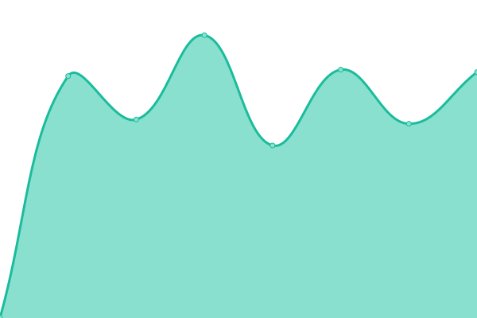

# [📈 Live Status](https://HyperLife1119.github.io/upptime): <!--live status--> **🟩 All systems operational**

This repository contains the open-source uptime monitor and status page for [HyperLifelll9](onch.at), powered by [Upptime](https://github.com/upptime/upptime).

With [Upptime](https://upptime.js.org), you can get your own unlimited and free uptime monitor and status page, powered entirely by a GitHub repository. We use [Issues](https://github.com/HyperLife1119/upptime/issues) as incident reports, [Actions](https://github.com/HyperLife1119/upptime/actions) as uptime monitors, and [Pages](https://HyperLife1119.github.io/upptime) for the status page.

<!--start: status pages-->
<!-- This summary is generated by Upptime (https://github.com/upptime/upptime) -->
<!-- Do not edit this manually, your changes will be overwritten -->
<!-- prettier-ignore -->
| URL | Status | History | Response Time | Uptime |
| --- | ------ | ------- | ------------- | ------ |
|  venus | 🟩 Up | [venus.yml](https://github.com/HyperLife1119/upptime/commits/HEAD/history/venus.yml) | 

 855ms
     
 | 

<a href="https://HyperLife1119.github.io/upptime/history/venus">100.00%</a>
    

|  rhea | 🟩 Up | [rhea.yml](https://github.com/HyperLife1119/upptime/commits/HEAD/history/rhea.yml) | 

 842ms
     
 | 

<a href="https://HyperLife1119.github.io/upptime/history/rhea">100.00%</a>
    

|  mars | 🟩 Up | [mars.yml](https://github.com/HyperLife1119/upptime/commits/HEAD/history/mars.yml) | 

 860ms
     
 | 

<a href="https://HyperLife1119.github.io/upptime/history/mars">100.00%</a>
    

|  titan | 🟩 Up | [titan.yml](https://github.com/HyperLife1119/upptime/commits/HEAD/history/titan.yml) | 

 1497ms
     
 | 

<a href="https://HyperLife1119.github.io/upptime/history/titan">100.00%</a>
    

|  alpha | 🟩 Up | [alpha.yml](https://github.com/HyperLife1119/upptime/commits/HEAD/history/alpha.yml) | 

 794ms
     
 | 

<a href="https://HyperLife1119.github.io/upptime/history/alpha">100.00%</a>
    

|  venus-web | 🟩 Up | [venus-web.yml](https://github.com/HyperLife1119/upptime/commits/HEAD/history/venus-web.yml) | 

 991ms
     
 | 

<a href="https://HyperLife1119.github.io/upptime/history/venus-web">100.00%</a>
    

|  rhea-web | 🟩 Up | [rhea-web.yml](https://github.com/HyperLife1119/upptime/commits/HEAD/history/rhea-web.yml) | 

 739ms
     
 | 

<a href="https://HyperLife1119.github.io/upptime/history/rhea-web">100.00%</a>
    

|  mars-web | 🟩 Up | [mars-web.yml](https://github.com/HyperLife1119/upptime/commits/HEAD/history/mars-web.yml) | 

 758ms
     
 | 

<a href="https://HyperLife1119.github.io/upptime/history/mars-web">100.00%</a>
    

|  titan-web | 🟩 Up | [titan-web.yml](https://github.com/HyperLife1119/upptime/commits/HEAD/history/titan-web.yml) | 

 778ms
     
 | 

<a href="https://HyperLife1119.github.io/upptime/history/titan-web">100.00%</a>
    

|  alpha-web | 🟩 Up | [alpha-web.yml](https://github.com/HyperLife1119/upptime/commits/HEAD/history/alpha-web.yml) | 

 754ms
     
 | 

<a href="https://HyperLife1119.github.io/upptime/history/alpha-web">100.00%</a>
    

<!--end: status pages-->

[**Visit our status website →**](https://HyperLife1119.github.io/upptime)

## 📄 License

- Powered by: [Upptime](https://github.com/upptime/upptime)
- Code: [MIT](./LICENSE) © [HyperLifelll9](onch.at)
- Data in the `./history` directory: [Open Database License](https://opendatacommons.org/licenses/odbl/1-0/)
